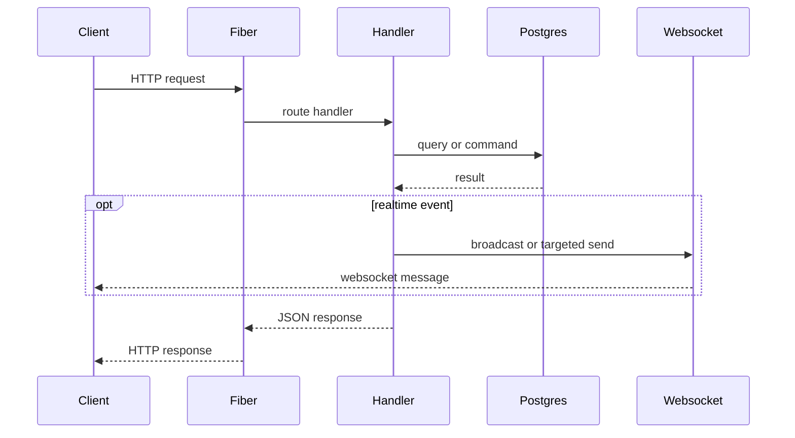

# PickMe Go Backend Architecture

## Current Scope

This backend is a Fiber API with PostgreSQL persistence and websocket-based realtime delivery for ride offers, ride acceptance, room joins, and driver location updates.

This refactor intentionally does not add product behavior. It moves the existing behavior into ownership-oriented packages so the codebase can scale safely.

## Package Layout

```text
cmd/server
  main.go                  # process entrypoint and dependency wiring

internal/config
  config.go                # environment loading and typed runtime config

internal/database
  postgres.go              # pgx pool construction and database health handlers

internal/middleware
  cors.go                  # HTTP CORS middleware
  auth.go                  # Supabase JWT Fiber middleware adapter

internal/auth
  supabase_jwt.go          # Supabase JWT validation

internal/websocket
  handler.go               # /ws connection lifecycle
  auth.go                  # websocket JWT handshake and room auth request checks
  authorizer.go            # database-backed ride room authorization
  manager.go               # global client and room broadcast manager
  registry.go              # rider and driver connection registries

internal/rides
  handler.go               # ride HTTP endpoints
  types.go                 # ride request/response/broadcast contracts

internal/drivers
  handler.go               # driver HTTP endpoints
  service.go               # driver session cleanup worker
  types.go                 # driver request/response/broadcast contracts

internal/wallet
  service.go               # reserved package for wallet/payment domain logic
```

## Runtime Wiring

```mermaid
flowchart TD
    main[cmd/server main] --> cfg[config.Load]
    main --> db[database.NewPool]
    main --> ws[websocket.Manager]
    main --> riders[Rider Registry]
    main --> drivers[Driver Registry]
    main --> fiber[Fiber App]

    fiber --> cors[CORS Middleware]
    fiber --> auth[Supabase JWT Middleware]
    fiber --> wsAuth[Websocket JWT + Room Auth]
    wsAuth --> wsHandler[/ws Handler]
    fiber --> rideRoutes[Ride Routes]
    fiber --> driverRoutes[Driver Routes]

    auth --> rideRoutes
    auth --> driverRoutes

    rideRoutes --> db
    rideRoutes --> ws
    rideRoutes --> riders
    rideRoutes --> drivers

    driverRoutes --> db
    driverRoutes --> ws

    cleanup[Driver Cleanup Worker] --> db
```

## HTTP Flow



## Realtime Ownership

The websocket package owns all websocket authentication, authorization, and in-memory connection state:

- `Manager` tracks all connected websocket clients.
- `Manager` tracks room membership by room ID.
- `ConnectionRegistry` tracks logical rider and driver IDs to their current websocket connection.
- Websocket identity is derived from Supabase JWT `sub`.
- Ride room membership is allowed only when the authenticated user is the ride's rider or assigned driver.

Ride handlers use the driver registry to send targeted `ride_offer` events, then preserve the previous global broadcast behavior. Ride acceptance uses the rider registry to notify the rider directly.

Driver handlers use the manager to broadcast driver location updates to a ride room when `ride_id` is present, or globally when no ride room is present.

Before broadcasting into a ride room, the driver location endpoint verifies that the authenticated driver is assigned to that ride and that the ride is `accepted` or `ongoing`.

## Authentication Boundary

`internal/auth` validates Supabase HS256 JWTs using `SUPABASE_JWT_SECRET`.

`internal/middleware.SupabaseJWT` converts that validator into Fiber middleware and stores validated claims in `c.Locals`.

The middleware is applied only to mutation routes that can create rides, accept rides, advance ride state, or modify driver presence/location.

Protected routes:

- `POST /rides/request`
- `POST /rides/:id/accept`
- `POST /rides/:id/start`
- `POST /rides/:id/complete`
- `POST /drivers/location`
- `POST /drivers/online`
- `POST /drivers/heartbeat`
- `POST /drivers/offline`
- `GET /ws`

Identity is derived from the JWT `sub` claim, not trusted from request JSON. If a request still includes `rider_id` or `driver_id`, it must match the authenticated subject or the API returns `403`.

Unauthenticated pilot surfaces remain:

- `GET /`
- `GET /health`
- `GET /test-db`
- `GET /rides`
- `POST /rides/join-room`
- `GET /drivers/nearby`

`GET /ws` accepts `Authorization: Bearer`, `access_token`, or `token`. Browser clients should use `access_token` because standard browser websocket APIs cannot reliably set custom authorization headers.

## Production Notes

- The websocket registries are process-local. Horizontal scaling will require sticky sessions, a shared realtime gateway, or a fanout layer such as Redis Pub/Sub, NATS, or Supabase Realtime.
- The driver cleanup worker is process-local. In multi-instance deployments, make sure duplicate workers are acceptable or move the job to a scheduled worker.
- The current database schema is assumed to already exist. This repository does not yet include migrations.
- Existing response strings and emoji have been preserved to avoid client regressions.
